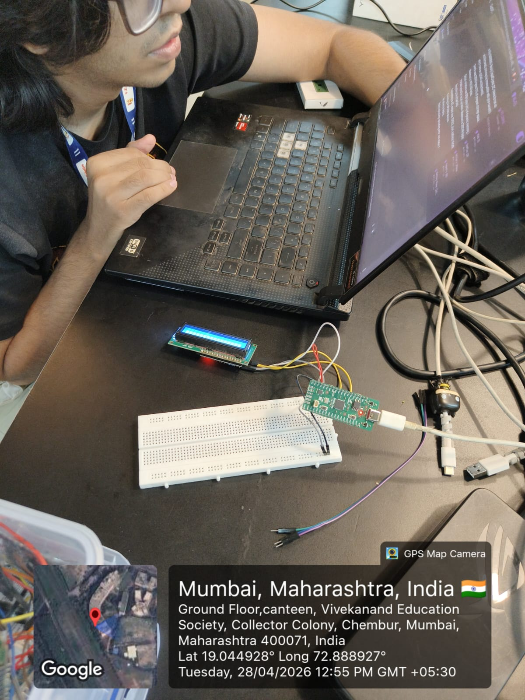
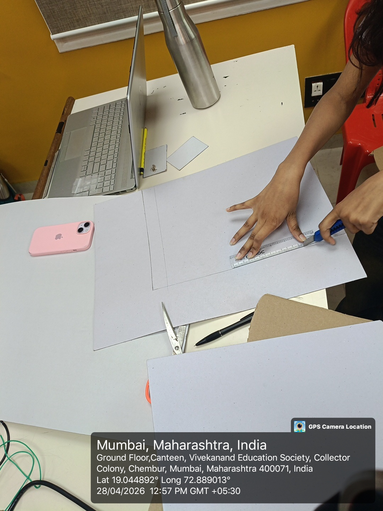
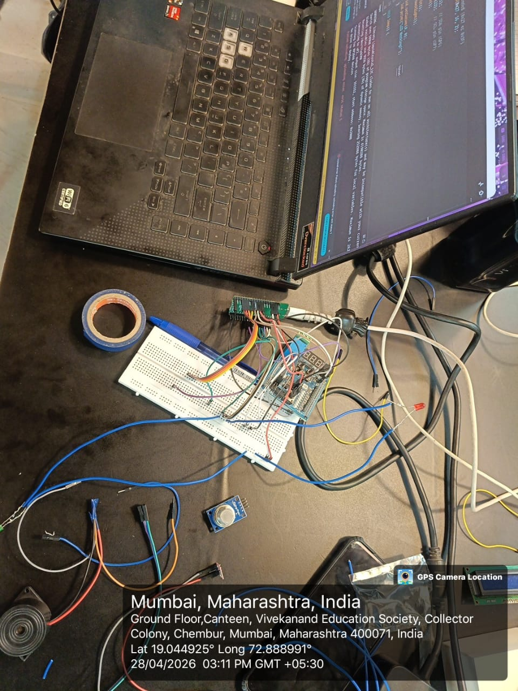
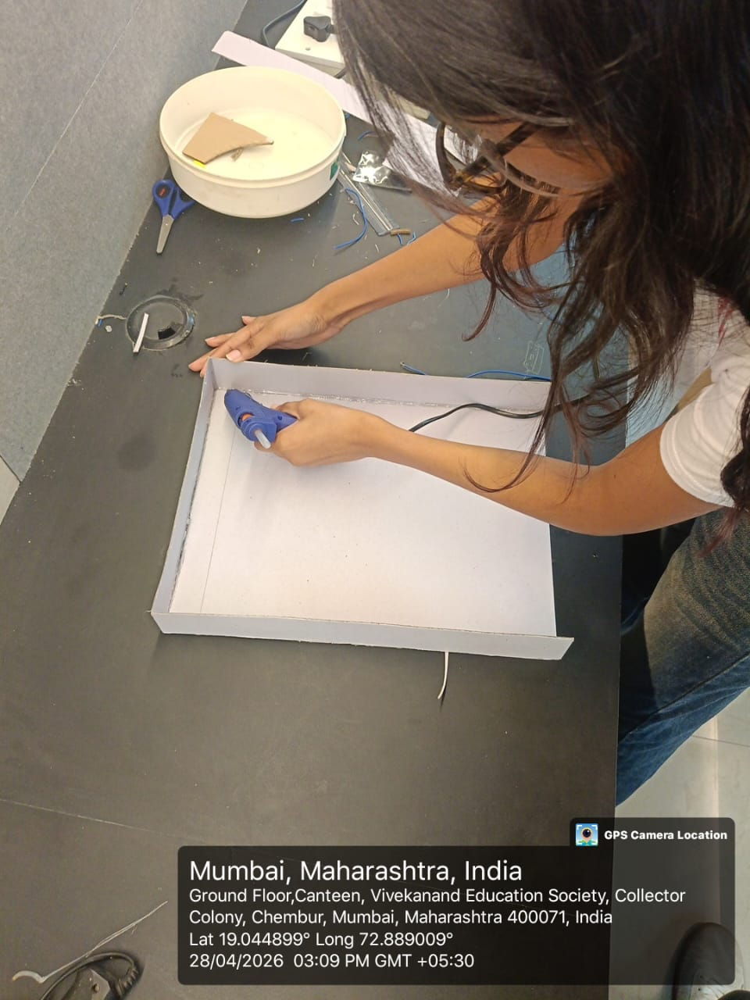

# SKILL LAB PRATICAL HACKATHON

## Final Project README

# 1. Team Identity

## 1.1 Studio / Group Name

`Chaos Protocol`

## 1.2 Team Members

| Name           | Primary Role                    | Secondary Role | Strengths Brought to the Project |
| -------------- | ------------------------------- | -------------- | -------------------------------- |
| `Dhruv Singh` | `[Coding]`                       | `Electronics`  | `Coding, Ideation `|
| `Yoshita Vishwakarma`  | `[Design]`   | `[Documentation]`     | `Documentation, Project Design `    |
| `Poorab Valecha`  | `[Electronics]`   | `[Documentation]`     | `Hardware, Material Handling`    |
| `Vansh Lalwani`  | `[Electronics]`   | `[Coding]`     | `Hardware, Problem Solving`    |

## 1.3 Project Title

`"Defuse Or Die by Chaos Protocol"`


## 1.4 One-Line Pitch

`A high-stakes, Two player bomb defusal game where every second, every choice, and every word could mean the difference between victory… or explosion.`

## 1.5 Expanded Project Idea

In 1–2 paragraphs, explain:

- what your project is,
- what kind of experience it creates,
- what technologies are involved.

**Response:**  
`**Defuse or Die** is an interactive, team-based bomb defusal game inspired by Keep Talking and Nobody Explodes, built using cardboard modules, sensors, and a Raspberry Pi Pico programmed through the Arduino IDE. The system generates randomized but solvable puzzles—such as wire-cutting, timed button holds, and gas-level control using an MQ2 sensor—while displaying a live countdown and strike system on an I2C LCD. Players must physically interact with the device to solve each module, with feedback provided through LEDs and a buzzer.

The experience is designed to create intense, fast-paced collaboration where one player (the defuser) handles the physical device while others (the experts) interpret instructions and guide them under time pressure. As the timer decreases, the buzzer frequency increases, building urgency and panic, while mistakes reduce available time and increase tension. By combining embedded systems, non-blocking Arduino programming, sensor integration, and tangible game design, the project delivers a highly engaging, real-world gaming experience that blends electronics, logic, and teamwork into a fun and memorable challenge.`

---

# 2. Philosophy Fit

## 2.1 Experience, Not Social Problem

*Problem Statement*
Design an engaging, real-time interactive game system that challenges players to collaborate under pressure to solve physical puzzles, while efficiently integrating sensors, embedded systems, and dynamic feedback to create a seamless and immersive experience.


# 3. Inspiration

## 3.1 References

List what inspired the project.

| Source Type | Title / Link                                                        | What Inspired You                                                                         |
| ----------- | ------------------------------------------------------------------- | ----------------------------------------------------------------------------------------- |
| `[Image]`   | `https://l1nk.dev/wwhlq4p` | `Inspired by Keep Talking and Nobody Explodes and escape-room challenges, the project brings high-pressure teamwork and puzzle-solving into a physical, sensor-based experience.` |
|             |                                                                     |                                                                                           |
|             |                                                                     |                                                                                           |

## 3.2 Original Twist

What makes your project original?

**Response:Defuse or Die isn’t the idea of a bomb-defusal game itself—it’s how we've translated a digital concept into a fully physical, low-cost, sensor-driven experience with real-time unpredictability.
Instead of copying Keep Talking and Nobody Explodes on a screen, our project creates a tangible, hands-on system using cardboard modules, MQ2 gas sensing, touch inputs, and servo mechanisms.**  


---

# 4. Project Intent

## 4.1 User Journey 

Describe exactly how a user will use the project.Make it a story
**Response:**  

                                                  |


---

# 5. Definition of Success

## 5.1 Definition of “Usable”


## 5.2 Minimum Usable Version

What is the smallest version of this project that still delivers the core experience?

**Response:**  


## 5.3 Stretch Features

What features are nice to have but not essential?


---

# 6. System Overview

## 6.1 Project Type

Check all that apply.

- [x] Electronics-based

- [ ] Mechanical

- [x] Sensor-based

- [ ] App-connected

- [ ] Motorized

- [x] Sound-based

- [x] Light-based

- [x] Screen/UI-based

- [ ] Fabricated structure

- [x] Game logic based

- [ ] Installation

- [ ] Other:

## 6.2 High-Level System Description

Explain how the system works in simple terms.

Include:

- input,
- processing,
- output,
- physical structure,
- app interaction if any.

**Response:**  

## 6.3 Input / Output Map

| System Part                              | Type            | What It Does                                                               |


---

# 7. Sketches and Visual Planning

## 7.1 Concept Sketch

**Insert image below:** 


Example:

```md

```


## 7.2 Labeled Build Sketch

**Insert image below:**  
`[Upload image and link here]`


## 7.3 Approximate Dimensions

| Dimension        | Value   |
| ---------------- | ------- |
| Length           | `16 cm` |
| Width            | `16 cm` |
| Height           | `8 cm`  |
| Estimated weight | `400 g` |

---

# 8. Electronics Planning

## 8.1 Electronics Used

| Component                 | Quantity | Purpose                               |
| ------------------------- | --------:| ------------------------------------- |
| `[Raspberry Pi Pico]`                 | `1`      | `[Main controller]`                   |
| `[Buzzers]`    | `1`      | `[Alert]`                    |
| `[LEDS]`             | `5`      | `[Indication]`                     |
| `[I2C LCD Display]`        | `1`      | `[Display]`                       |
| `[Push Buttons]`   | `4`      | `[Input]`                             |
| `[MQ2 Sensor]`             | `1`      | `[Sensing]`                 |
| `Breadboard` | `1`      | `[Prototyping]` |
| `Touch Sensor` | `1`      | `[Detection]` |


## 8.2 Wiring Plan

Describe the main electrical connections.

**Response:**  
`The ESP32 is connected to the motor driver (L298N) using four GPIO pins (18,19; 22,23) to control motor direction (IN1, IN2, IN3, IN4). Two PWM-capable pins (ENA and ENB; 25 and 26) are connected to control the speed of each motor.

The motors are connected to the output terminals of the motor driver. The motor driver is powered directly by the battery pack (higher voltage), while the ESP32 receives regulated 5V from the buck converter.

All components share a common ground to ensure stable operation. The projector and camera are connected to the laptop, which handles tracking and game logic separately.`

## 8.3 Circuit Diagram

Insert a hand-drawn or software-made circuit diagram.

**Insert image below:**  
`[Upload image and link here]`


# 9. Power Plan

| Question         | Response                                                                                                                                          |
| ---------------- | ------------------------------------------------------------------------------------------------------------------------------------------------- |
| Power source     | `Battery (Li-ion pack)`                                                                                                                           |
| Voltage required | `~6–8.4V for motors (via driver), stepped down to 5V for ESP32 (buck converter)`                                                                  |
| Current concerns | `Motors can draw high current under load, which may cause voltage drops affecting ESP32 and WiFi stability`                                       |
| Safety concerns  | `Avoid over-discharging Li-ion batteries, ensure proper voltage regulation, prevent short circuits, and secure wiring to avoid loose connections` |

---

# 10. Software Planning

## 10.1 Software Tools

| Tool / Platform                | Purpose                                        |
| ------------------------------ | ---------------------------------------------- |
| `[MicroPython]`                | `Control ESP32`                                |
| `[Python/PyGame/OpenCV]`       | `Track markers, game logic, create projection` |
| `[Fusion/Blender/Illustrator]` | `[Prototyping structure]`                      |
|                                |                                                |

## 10.2 Software Logic

Describe what the code must do.

Include:

- startup behavior,
- input handling,
- sensor reading,
- decision logic,
- output behavior,
- communication logic,
- reset behavior.

**Response:**  
`

- **Startup behavior:**  
  The ESP32 initializes motor pins, PWM control, and starts a WiFi access point with a web server. The laptop initializes camera input, tracking system, and projection mapping.
- **Input handling:**  
  Movement commands are received from the laptop (pygame sends http requests)
- **Sensor reading:**  
  The camera continuously captures frames, and OpenCV detects ArUco markers to determine the car’s position and orientation.
- **Decision logic:**  
  The system maps the car’s position into a virtual coordinate system and checks for nearby obstacles or collisions. If movement is valid, the command is allowed; if not, it is blocked or replaced with a feedback action (like a slight shake).
- **Output behavior:**  
  The ESP32 drives the motors using PWM signals to control speed and direction. The projector displays the updated game environment, including obstacles, targets, and feedback visuals.
- **Communication logic:**  
  The laptop sends HTTP requests (e.g., `/forward`, `/left`) to the ESP32 over WiFi. The ESP32 parses these commands and executes motor actions.
- **Reset behavior:**  
  If no command is received within a short timeout, the ESP32 stops the motors. The game resets when a level is completed or restarted.`

## 10.3 Code Flowchart

Insert a flowchart showing your code logic.

Suggested sequence:

- start,
- initialize,
- wait for input,
- read input,
- decision,
- trigger output,
- repeat or reset,
- error handling.

**Insert image below:**  


# 11. Bill of Materials

## 11.1 Full BOM

| Item                             | Quantity | In Kit? | Need to Buy? | Estimated Cost | Material / Spec               | Why This Choice?          |
| -------------------------------- | --------:| ------- | ------------ | --------------:| ----------------------------- | ------------------------- |
| `[Raspberry Pi Pico]`            | `[1]`      | `Yes`   | `No`         | `0`            |                                | `[To control components]` |
| `[Buzzers]`                      | `[1]`    | `[Yes]` | `[No]`       | `0`            |                                  | `[audio alert]`  |
| `[LEDs]`                         | `[5]`    | `[Yes]`  | `[No]`      | `[0]`        |                                 | `[visual feedback]`    |
| `[I2C LCD Display]`              | `[1]`    | `[Yes]`  | `[No]`      | `[0]`         |                               |    `[status display]`    |
| `[Push Button]`                  | `[4]`    | `[Yes]`  | `[No]`      | `[0]`        |                               |  `[user input]`     |
| `[MQ2 Sensors]`                  | `[1]`    | `[Yes]`  | `[No]`      | `[0]`        |                               |   `[gas sensing]`   |
| `[Breadboard]`                   | `[1]`    | `[Yes]`  | `[No]`      | `[0]`        |                               |    `[quick prototyping]`   |
| `[Touch Sensor]`                 | `[1]`    | `[Yes]`  | `[No]`      | `[0]`        |                               |   `[touch detections]`    |

## 11.2 Material Justification

Explain why you selected your main materials and components.

**Response:**  

`We selected the Raspberry Pi Pico because it is a compact and cost-effective microcontroller capable of handling multiple sensors and outputs simultaneously, making it ideal for a multi-module game system. A breadboard and jumper wires were used to enable quick, solderless connections, allowing us to prototype and modify our circuit easily within the limited hackathon time.

For user interaction and feedback, we used an I/O Shield to display the timer and clearly while minimizing wiring complexity. LEDs and a buzzer were included to provide immediate visual and audio feedback, enhancing the urgency and user experience. Resistors were necessary to ensure safe operation by controlling current flow.

To make the game interactive, we used push buttons, touch sensors, and wire connections for intuitive input methods, while the MQ2 sensor was incorporated to introduce a unique, sensor-based challenge beyond basic inputs.

For construction, cardboard was chosen as the main material because it is lightweight, low-cost, and easy to shape, allowing rapid prototyping. Supporting materials like tape, glue, and colored markings help in assembly and improve clarity.`


## 11.3 Items You chose

| Item                 | Why Needed               | 
| -------------------- | ------------------------ |
| `MQ2 Gas Sensor` | `Gas Sensing`   |
| `Touch Sensor(TTP223)`     | `Touch Detection` |
| `Push Button`   | `Input`         | 

## 11.4 Budget Summary

| Budget Item           | Estimated Cost              |
| --------------------- | ---------------------------:|
| Electronics           | `[Available on campus]`                     |
| Mechanical parts      | `[Available on campus]`                     |
| Fabrication materials | `[Available on campus]` |
| Purchased extras      | `[0]`                       |
| **Total**             | `[0]`                     |

## 11.5 Budget Reflection

If your cost is too high, what can be simplified, removed, substituted, or shared?

**Response:**  

---

# 12. Planning the Work

## 12.1 Team Working Agreement

Write how your team will work together.

Include:

- how tasks are divided,
- how decisions are made,
- how progress will be checked,
- what happens if a task is delayed,
- how documentation will be maintained.

**Response:**  


## 12.2 Task Breakdown

| Task ID | Task                    | Owner    | Estimated Hours | Deadline     | Dependency | Status |
| ------- | ----------------------- | -------- | ---------------:| ------------ | ---------- | ------ |
| T1      | `[Finalize concept]`    | `[Both]` | `2`             | `1st April`  | `None`     | `Done` |


## 12.3 Responsibility Split

| Area                 | Main Owner | Support Owner |
| -------------------- | ---------- | ------------- |
| Concept              | `[Gopal]`  | `[Kader]`    |
| Electronics          | `[]`       | `[]`     |
| Coding               | `[]`       | `[]`     |
| Mechanical build     | `[]`       | `[]`    |
| Testing              | `[]`       | `[]`    |
| Documentation        | `[]`       | `[]`     |

---

# 13. 2 hour Milestones

## 13.1 8-hour Plan

### Bi Hour 1 — Plan and De-risk

Expected outcomes:

- [x] Idea finalized
- [x] Core interaction decided
- [x] Sketches made
- [x] BOM completed
- [x] Purchase needs identified
- [ ] Key uncertainty identified
- [x] Basic feasibility tested

### Bi Hour 2 — Build Subsystems

Expected outcomes:

- [ ] Electronics tests completed
- [x] CAD / structure planning completed
- [ ] App UI started if needed
- [x] Mechanical concept tested
- [x] Main subsystems partially working

### Bi Hour 3 — Integrate

Expected outcomes:

- [x] Physical body built
- [x] Electronics integrated
- [x] Code connected to hardware
- [ ] App connected if required
- [x] First playable version exists

### Bi Hour 4 — Refine and Finish

Expected outcomes:

- [x] Technical bugs reduced
- [x] Playtesting completed
- [x] Improvements made
- [x] Documentation completed
- [x] Final build ready

## 13.2  Update Log

| Week   | Planned Goal   | What Actually Happened | What Changed   | Next Steps     |
| ------ | -------------- | ---------------------- | -------------- | -------------- |
| Hour 1 | `[Idea Finalized]` | `[Idea Finalized]`         | `[NA]` | `[Component Finalization]` |
| Hour 2 | `[Component Finalization]` | `Components Finalized]`         | `[Shrike Lite not working]` | `[Connections]` |
| Week 3 | `[Write here]` | `[Write here]`         | `[Write here]` | `[Write here]` |
| Week 4 | `[Write here]` | `[Write here]`         | `[Write here]` | `[Write here]` |

Update 1: Basic connections started with fabrication.



Update 2: Fabrication completed and for the components we had to replace I2C LCD with 7 segment display.




---

# 14. Risks and Unknowns

## 14.1 Risk Register

| Risk                                                            | Type         | Likelihood | Impact   | Mitigation Plan                                                                       | Owner                |
| --------------------------------------------------------------- | ------------ | ---------- | -------- | ------------------------------------------------------------------------------------- | -------------------- |
| WiFi connection between laptop and ESP32 becomes unstable       | `Technical`  | `Medium`   | `High`   | Keep ESP32 close, ensure stable power supply, reduce network load, add fail-safe stop | `[Gopal]`           |


## 14.2 Biggest Unknown Right Now

What is the single biggest uncertainty in your project at this stage?

**Response:**  


---

# 15. Testing 

## 15.1 Technical Testing Plan

| What Needs Testing     | How You Will Test It                                                                 | Success Condition                                                                                    |
| ---------------------- | ------------------------------------------------------------------------------------ | ---------------------------------------------------------------------------------------------------- |
| `[Wifi connection]`    | `[Check if motor spins via app button]`                                              | `[Both motors accurately respond to wifi signals]`                                                   |
                       |
## 15.2 Testing and Debugging Log

| Date          | Problem Found                         | Type         | What You Tried                                | Result               | Next Action                                    |
| ------------- | ------------------------------------- | ------------ | --------------------------------------------- | -------------------- | ---------------------------------------------- |
| `18th April`  | `Car not balancing properly`          | `Mechanical` | `Add low-friction caster support to one side` | `Worked`             | `improve caster structure`                     |


## 15.3 Playtesting Notes

| Tester      | What They Did                        | What Confused Them                    | What They Enjoyed                         | What You Will Change                          |
| ----------- | ------------------------------------ | ------------------------------------- | ----------------------------------------- | --------------------------------------------- |
| `Gopal` | `Tried navigating through obstacles` | `Some obstacles ewren't clear enough` | `Liked projection + real car interaction` | `Add a slight red highlight around obstacles` |


---

# 16. Build Documentation

## 16.1 Fabrication Process

Describe how the project was physically made.

Include:

- cutting,
- 3D printing,
- assembly,
- fastening,
- wiring,
- finishing,
- revisions.

**Response:**  
`The fabrication process involved designing, manufacturing, assembling, and refining both the physical structure and electronic integration of the system.`

`Design (CAD Modeling):
The initial model was created using CAD software, where components were designed based on the actual dimensions of the electronic parts. This ensured accurate fitting and minimized errors during assembly.
Cutting (Laser Cutting):
The designed parts were fabricated using laser cutting techniques. Sheets were cut precisely according to the CAD model to create the structural base and mounts for components.`

`Components were fixed using adhesives and mechanical supports. Certain parts were intentionally kept modular (not permanently fixed) to allow easy replacement and modification of electronics.
Surface Finishing:
Some parts were sanded to smooth rough edges after cutting. Sawdust mixed with adhesive was used to fill gaps and uneven edges, improving structural finish. The final structure was then painted for better aesthetics and durability.`

`Environment Setup (Dark Room Fabrication):
To enhance projection visibility, a controlled dark environment was created using Z-boards, paper sheets, and bedsheets. This minimized external light interference and improved projection clarity.
Revisions and Iterations:
Multiple adjustments were made throughout the process, including refining alignment, improving structural stability, repositioning components, and optimizing the interaction between the physical car and projected environment.`

## 16.2 Build Photos

Add photos throughout the project.

Suggested images:

- early sketch,
- prototype,
- electronics testing,
- mechanism test,
- app screenshot,
- final build.
- 


# 17. Final Outcome

## 17.1 Final Description

Describe the final version of your project.

**Response:**  


## 17.2 What Works Well


## 17.3 What Still Needs Improvement


## 17.4 What Changed From the Original Plan

How did the project change from the initial idea?

**Response:**  


---

# 18. Reflection

## 18.1 Team Reflection

What did your team do well?  
What slowed you down?  
How well did you manage time, tasks, and responsibilities?

**Response:**  


## 18.2 Technical Reflection

What did you learn about:

- electronics,
- coding,
- mechanisms,
- fabrication,
- integration?

**Response:**  


## 18.3 Design Reflection

What did you learn about:

- designing ,
- delight,
- clarity,
- physical interaction,
- understanding,
- iteration?

**Response:**  


## 18.4 If You Had One More hour

What would you improve next?

**Response:**  

` `

---

# 19. Final Submission Checklist

Before submission, confirm that:

- [x] Team details are complete
- [x] Project description is complete
- [x] Inspiration sources are included
- [x] Sketches are added
- [x] BOM is complete
- [x] Purchase list is complete
- [x] Budget summary is complete
- [x] Mechanical planning is documented if applicable
- [ ] App planning is documented if applicable
- [x] Code flowchart is added
- [x] Task breakdown is complete
- [x] Weekly logs are updated
- [x] Risk register is complete
- [x] Testing log is updated
- [x] Playtesting notes are included
- [x] Build photos are included
- [x] Final reflection is written


---


---


