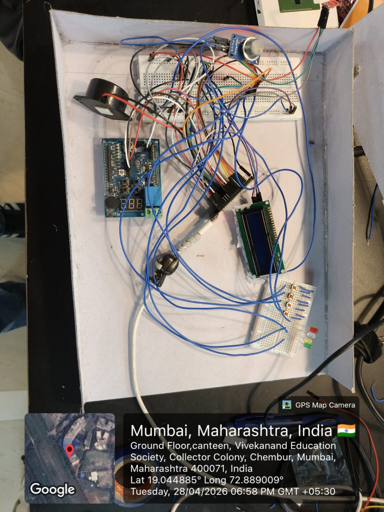

# SKILL LAB PRATICAL HACKATHON

## Final Project README

# 1. Team Identity

## 1.1 Studio / Group Name

`Chaos Protocol`

## 1.2 Team Members

| Name           | Primary Role                    | Secondary Role | Strengths Brought to the Project |
| -------------- | ------------------------------- | -------------- | -------------------------------- |
| `Dhruv Singh` | `[Coding]`                       | `Electronics`  | `Coding, Ideation `|
| `Yoshita Vishwakarma`  | `[Design]`   | `[Documentation]`     | `Documentation, Project Design `    |
| `Poorab Valecha`  | `[Electronics]`   | `[Documentation]`     | `Hardware, Material Handling`    |
| `Vansh Lalwani`  | `[Electronics]`   | `[Coding]`     | `Hardware, Problem Solving`    |

https://youtube.com/shorts/R1lEeZ2L4As?feature=share

## 1.3 Project Title

`"Defuse Or Die by Chaos Protocol"`


## 1.4 One-Line Pitch

`A high-stakes, Two player bomb defusal game where every second, every choice, and every word could mean the difference between victory… or explosion.`

## 1.5 Expanded Project Idea

In 1–2 paragraphs, explain:

- what your project is,
- what kind of experience it creates,
- what technologies are involved.

**Response:**  
`**Defuse or Die** is an interactive, team-based bomb defusal game inspired by Keep Talking and Nobody Explodes, built using cardboard modules, sensors, and a Raspberry Pi Pico programmed through the Arduino IDE. The system generates randomized but solvable puzzles—such as wire-cutting, timed button holds, and gas-level control using an MQ2 sensor—while displaying a live countdown and strike system on an I2C LCD. Players must physically interact with the device to solve each module, with feedback provided through LEDs and a buzzer.

The experience is designed to create intense, fast-paced collaboration where one player (the defuser) handles the physical device while others (the experts) interpret instructions and guide them under time pressure. As the timer decreases, the buzzer frequency increases, building urgency and panic, while mistakes reduce available time and increase tension. By combining embedded systems, non-blocking Arduino programming, sensor integration, and tangible game design, the project delivers a highly engaging, real-world gaming experience that blends electronics, logic, and teamwork into a fun and memorable challenge.`

---

# 2. Philosophy Fit

## 2.1 Experience, Not Social Problem

*Problem Statement*
Design an engaging, real-time interactive game system that challenges players to collaborate under pressure to solve physical puzzles, while efficiently integrating sensors, embedded systems, and dynamic feedback to create a seamless and immersive experience.


# 3. Inspiration

## 3.1 References

List what inspired the project.

| Source Type | Title / Link                                                        | What Inspired You                                                                         |
| ----------- | ------------------------------------------------------------------- | ----------------------------------------------------------------------------------------- |
| `[Image]`   | `https://l1nk.dev/wwhlq4p` | `Inspired by Keep Talking and Nobody Explodes and escape-room challenges, the project brings high-pressure teamwork and puzzle-solving into a physical, sensor-based experience.` |
|             |                                                                     |                                                                                           |
|             |                                                                     |                                                                                           |

## 3.2 Original Twist

What makes your project original?

**Response:Defuse or Die isn’t the idea of a bomb-defusal game itself—it’s how we've translated a digital concept into a fully physical, low-cost, sensor-driven experience with real-time unpredictability.
Instead of copying Keep Talking and Nobody Explodes on a screen, our project creates a tangible, hands-on system using cardboard modules, MQ2 gas sensing, touch inputs, and servo mechanisms.**  


---

# 4. Project Intent

## 4.1 User Journey 

Describe exactly how a user will use the project.Make it a story
**Response:**  

                                                  |


---

# 5. Definition of Success

## 5.1 Definition of “Usable”


## 5.2 Minimum Usable Version

What is the smallest version of this project that still delivers the core experience?

**Response:**  


## 5.3 Stretch Features

What features are nice to have but not essential?


---

# 6. System Overview

## 6.1 Project Type

Check all that apply.

- [x] Electronics-based

- [ ] Mechanical

- [x] Sensor-based

- [ ] App-connected

- [ ] Motorized

- [x] Sound-based

- [x] Light-based

- [x] Screen/UI-based

- [ ] Fabricated structure

- [x] Game logic based

- [ ] Installation

- [ ] Other:

## 6.2 High-Level System Description

Explain how the system works in simple terms.

Include:

- input,
- processing,
- output,
- physical structure,
- app interaction if any.

**Response:**  

## 6.3 Input / Output Map

| System Part                              | Type            | What It Does                                                               |


---

# 7. Sketches and Visual Planning

## 7.1 Concept Sketch

**Insert image below:** 


Example:

```md

```


## 7.2 Labeled Build Sketch

**Insert image below:**  
`[Upload image and link here]`


## 7.3 Approximate Dimensions

| Dimension        | Value   |
| ---------------- | ------- |
| Length           | `16 cm` |
| Width            | `16 cm` |
| Height           | `8 cm`  |
| Estimated weight | `400 g` |

---

# 8. Electronics Planning

## 8.1 Electronics Used

| Component                 | Quantity | Purpose                               |
| ------------------------- | --------:| ------------------------------------- |
| `[Raspberry Pi Pico]`                 | `1`      | `[Main controller]`                   |
| `[Buzzers]`    | `1`      | `[Alert]`                    |
| `[LEDS]`             | `5`      | `[Indication]`                     |
| `[I2C LCD Display]`        | `1`      | `[Display]`                       |
| `[Push Buttons]`   | `4`      | `[Input]`                             |
| `[MQ2 Sensor]`             | `1`      | `[Sensing]`                 |
| `Breadboard` | `1`      | `[Prototyping]` |
| `Touch Sensor` | `1`      | `[Detection]` |


## 8.2 Wiring Plan

Describe the main electrical connections.

**Response:**  
The **Raspberry Pi Pico** acts as the central controller, where all components are connected to its GPIO pins. Power is distributed using the **3.3V pin (Pin 36)** for most modules and a **common GND (Pin 38)** shared across all components to ensure stable and accurate signal referencing.

The **I2C LCD** is connected using the I2C protocol to reduce wiring complexity. Its **VCC is connected to 3.3V**, **GND to ground**, **SDA to GP4 (Pin 6)**, and **SCL to GP5 (Pin 7)**. This allows the Pico to send data using just two communication lines while displaying the timer and game status.

The **push button** is connected between **GP14 (Pin 19)** and **GND**, and it uses the Pico’s internal pull-up resistor. This means the pin reads HIGH normally and goes LOW when the button is pressed, ensuring reliable input detection without extra components.

The **touch sensor (TTP223)** is powered by **3.3V and GND**, with its output connected to **GP15 (Pin 20)**. It sends a HIGH signal when touched, allowing smooth and responsive input without mechanical wear.

The **wire-cutting module** uses GPIO pins like **GP2 (Pin 4), GP3 (Pin 5), and GP6 (Pin 9)**. Each wire connects the pin to **GND**, and internal pull-ups keep the signal HIGH. When a wire is cut, the connection breaks and the change in signal is detected, simulating real defusal actions.

The **MQ2 gas sensor** is connected with **VCC to 3.3V, GND to ground**, and its analog output connected to **GP26 (Pin 31 / ADC0)**. This allows the Pico to read varying gas levels as analog values, adding a dynamic sensing element to the game.

The **LEDs** are connected to GPIO pins such as **GP16 (Pin 21) and GP17 (Pin 22)** through **current-limiting resistors (220Ω)**. These LEDs provide visual feedback for correct or incorrect actions and game states.

The **buzzer** is connected to **GP18 (Pin 24)**, which supports PWM output. This allows the system to generate different beep patterns and increase frequency as the timer runs out, creating urgency.`

## 8.3 Circuit Diagram

Insert a hand-drawn or software-made circuit diagram.

**Insert image below:**  
`[Upload image and link here]`


# 9. Power Plan

| Question         | Response                                                                                                                                          |
| ---------------- | ------------------------------------------------------------------------------------------------------------------------------------------------- |
| Power source     | `Battery (Li-ion pack)`                                                                                                                           |
| Voltage required | `~6–8.4V for motors (via driver), stepped down to 5V for ESP32 (buck converter)`                                                                  |
| Current concerns | `Motors can draw high current under load, which may cause voltage drops affecting ESP32 and WiFi stability`                                       |
| Safety concerns  | `Avoid over-discharging Li-ion batteries, ensure proper voltage regulation, prevent short circuits, and secure wiring to avoid loose connections` |

---

# 10. Software Planning

## 10.1 Software Tools

| Tool / Platform                | Purpose                                        |
| ------------------------------ | ---------------------------------------------- |
| `[C++]`                | `control Raspberry Pi Pico2 `                                |

## 10.2 Software Logic

**Response:**  
`At **startup**, the system initializes all components including the LCD, sensors, buttons, buzzer, and LEDs, sets the timer and strike count to default values, and generates randomized but valid rules for each module so every game session is different.

For **input handling**, the code continuously monitors all user inputs such as button presses, touch sensors, and wire connections without blocking other operations. In parallel, it performs **sensor reading**, especially from the MQ2 sensor, to detect changes in gas levels and determine whether the required condition has been met.

The **decision logic** compares user actions and sensor values against the pre-generated rules to determine whether a step is correct or incorrect. Based on this, it updates the game state, such as marking modules as solved or increasing the strike count and reducing time in case of errors.

For **output behavior**, the system updates the LCD with the remaining time and strikes, controls LEDs for visual feedback, and adjusts the buzzer frequency dynamically to create urgency as time decreases. In terms of **communication logic**, the system communicates game status clearly through the display and feedback mechanisms, allowing players to understand what is happening in real time.

Finally, for **reset behavior**, the system can restart the game by reinitializing all variables, regenerating rules, resetting the timer and strikes, and preparing all modules for a new round without needing to reprogram the device.`

## 10.3 Code Flowchart

Insert a flowchart showing your code logic.

Suggested sequence:

- start,
- initialize,
- wait for input,
- read input,
- decision,
- trigger output,
- repeat or reset,
- error handling.

**Insert image below:**  


# 11. Bill of Materials

## 11.1 Full BOM

| Item                             | Quantity | In Kit? | Need to Buy? | Estimated Cost | Material / Spec               | Why This Choice?          |
| -------------------------------- | --------:| ------- | ------------ | --------------:| ----------------------------- | ------------------------- |
| `[Raspberry Pi Pico]`            | `[1]`      | `Yes`   | `No`         | `0`            |                                | `[To control components]` |
| `[Buzzers]`                      | `[1]`    | `[Yes]` | `[No]`       | `0`            |                                  | `[audio alert]`  |
| `[LEDs]`                         | `[5]`    | `[Yes]`  | `[No]`      | `[0]`        |                                 | `[visual feedback]`    |
| `[I2C LCD Display]`              | `[1]`    | `[Yes]`  | `[No]`      | `[0]`         |                               |    `[status display]`    |
| `[Push Button]`                  | `[4]`    | `[Yes]`  | `[No]`      | `[0]`        |                               |  `[user input]`     |
| `[MQ2 Sensors]`                  | `[1]`    | `[Yes]`  | `[No]`      | `[0]`        |                               |   `[gas sensing]`   |
| `[Breadboard]`                   | `[1]`    | `[Yes]`  | `[No]`      | `[0]`        |                               |    `[quick prototyping]`   |
| `[Touch Sensor]`                 | `[1]`    | `[Yes]`  | `[No]`      | `[0]`        |                               |   `[touch detections]`    |

## 11.2 Material Justification

Explain why you selected your main materials and components.

**Response:**  

`We selected the Raspberry Pi Pico because it is a compact and cost-effective microcontroller capable of handling multiple sensors and outputs simultaneously, making it ideal for a multi-module game system. A breadboard and jumper wires were used to enable quick, solderless connections, allowing us to prototype and modify our circuit easily within the limited hackathon time.

For user interaction and feedback, we used an I/O Shield to display the timer and clearly while minimizing wiring complexity. LEDs and a buzzer were included to provide immediate visual and audio feedback, enhancing the urgency and user experience. Resistors were necessary to ensure safe operation by controlling current flow.

To make the game interactive, we used push buttons, touch sensors, and wire connections for intuitive input methods, while the MQ2 sensor was incorporated to introduce a unique, sensor-based challenge beyond basic inputs.

For construction, cardboard was chosen as the main material because it is lightweight, low-cost, and easy to shape, allowing rapid prototyping. Supporting materials like tape, glue, and colored markings help in assembly and improve clarity.`


## 11.3 Items You chose

| Item                 | Why Needed               | 
| -------------------- | ------------------------ |
| `MQ2 Gas Sensor` | `Gas Sensing`   |
| `Touch Sensor(TTP223)`     | `Touch Detection` |
| `Push Button`   | `Input`         | 

## 11.4 Budget Summary

| Budget Item           | Estimated Cost              |
| --------------------- | ---------------------------:|
| Electronics           | `[Available on campus]`                     |
| Mechanical parts      | `[Available on campus]`                     |
| Fabrication materials | `[Available on campus]` |
| Purchased extras      | `[0]`                       |
| **Total**             | `[0]`                     |

## 11.5 Budget Reflection

If your cost is too high, what can be simplified, removed, substituted, or shared?

**Response:**  

NA

# 12. Planning the Work

## 12.1 Team Working Agreement

**Response:**  
How tasks are divided

We divided the task by first knowing the strength of each team memeber and alloting the respective work along with their strength

How decisions are made

We collectviely discuss the new solution or feature and vote whether we can do it or not

How progress will be checked

We update the log book hourly or whenever we do a change or improve our project

What happens if a task is delayed

If the task is delayed firstly we sit together and find the issue and try to solve it, and increase the workload on that particular thing, for example if our hardware got delayed then 2 person start working on that part of the project

How documentation will be maintained.

Every time something changes,or we buy something or happens we update that on the designated section under the github repo and every couple of hours we upload the photo or our current progress

## 12.2 Task Breakdown

| Task ID | Task                    | Owner    | Estimated Hours | Deadline     | Dependency | Status |
| ------- | ----------------------- | -------- | ---------------:| ------------ | ---------- | ------ |
| T1      | `[Finalize concept]`    | `[All]` | `1hr`             | `28st April`  | `None`     | `Done` |
| T1      | `[Software]`            | `[Dhruv]` | `3hr`             | `28st April`  | `None`     | `Working` |
| T1      | `[Connections]`    | `[Vansh]` | `2hr`             | `28st April`  | `None`     | `Done` |
| T1      | `[Fabrication]`    | `[Yoshita]` | `1hr`             | `28st April`  | `None`     | `Done` |
| T1      | `[Documention]`    | `[Poorab, Yoshita]` | `6hr`             | `28st April`  | `None`     | `Working` |


## 12.3 Responsibility Split

| Area                 | Main Owner | Support Owner |
| -------------------- | ---------- | ------------- |
| Concept              | `[All]`  | `[]`    |
| Electronics          | `[Vansh]`       | `[Yoshita]`     |
| Coding               | `[Dhruv]`       | `[Vansh]`     |
| Mechanical build     | `[Poorab]`       | `[]`    |
| Testing              | `[Vansh]`       | `[]`    |
| Documentation        | `[Yoshita]`       | `[Poorab]`     |

---

# 13. 2 hour Milestones

## 13.1 8-hour Plan

### Bi Hour 1 — Plan and De-risk

Expected outcomes:

- [x] Idea finalized
- [x] Core interaction decided
- [x] Sketches made
- [x] BOM completed
- [x] Purchase needs identified
- [ ] Key uncertainty identified
- [x] Basic feasibility tested

### Bi Hour 2 — Build Subsystems

Expected outcomes:

- [ ] Electronics tests completed
- [x] CAD / structure planning completed
- [ ] App UI started if needed
- [x] Mechanical concept tested
- [x] Main subsystems partially working

### Bi Hour 3 — Integrate

Expected outcomes:

- [x] Physical body built
- [x] Electronics integrated
- [x] Code connected to hardware
- [ ] App connected if required
- [x] First playable version exists

### Bi Hour 4 — Refine and Finish

Expected outcomes:

- [x] Technical bugs reduced
- [x] Playtesting completed
- [x] Improvements made
- [x] Documentation completed
- [x] Final build ready

## 13.2  Update Log

| Week   | Planned Goal   | What Actually Happened | What Changed   | Next Steps     |
| ------ | -------------- | ---------------------- | -------------- | -------------- |
| Hour 1 | `[Idea Finalized]` | `[Idea Finalized]`         | `[NA]` | `[Component Finalization]` |
| Hour 2 | `[Component Finalization]` | `Components Finalized]`         | `[Shrike Lite not working]` | `[Connections]` |
| Hour 3 | `[Write here]` | `[Write here]`         | `[Write here]` | `[Write here]` |
| Week 4 | `[Write here]` | `[Write here]`         | `[Write here]` | `[Write here]` |

Update 1: Basic connections started with fabrication.


Update 2: Fabrication completed and for the components we had to replace I2C LCD with 7 segment display.


Update 3: completed with the circuit connections. We had problem with the working of I/O Shield so we again replaced it with I2C LCD Dislay. We found out that we were using I2C0 instead of I2C1 communication and our Vicharak Shrike Lite only supports I2C1.


UPDATE 4: We completed with our final working build.


---

# 14. Risks and Unknowns

## 14.1 Risk Register

| Risk                                                            | Type         | Likelihood | Impact   | Mitigation Plan                                                                       | Owner                |
| I2C not working              |        dhruv         | technical | medium       |     high       | we used I2C1 instead of I2C0 |


## 14.2 Biggest Unknown Right Now

What is the single biggest uncertainty in your project at this stage?

**Response:**  
The single biggest uncertainty in our project is ensuring smooth, real-time coordination between all modules without delays or conflicts. Since multiple inputs (buttons, touch sensors, MQ2, wires) and outputs (LCD, buzzer, LEDs) must operate simultaneously, managing everything with non-blocking logic on the Raspberry Pi Pico can be challenging. Any timing issue or unexpected sensor behavior could affect gameplay flow, so maintaining reliable synchronization under real-time conditions is our main concern.


---

# 15. Testing 

## 15.1 Technical Testing Plan

| What Needs Testing     | How You Will Test It                                                                 | Success Condition                                                                                    |
| ---------------------- | ------------------------------------------------------------------------------------ | ---------------------------------------------------------------------------------------------------- |
| `[LCD Display output]`    | `[check if the connections are proper and the compiled code is displaying the output ]`                                              | `[the display is showing the output]`                                                   |
                       |
## 15.2 Testing and Debugging Log

| Date          | Problem Found                         | Type         | What You Tried                                | Result               | Next Action                                    |
| ------------- | ------------------------------------- | ------------ | --------------------------------------------- | -------------------- | ---------------------------------------------- |
| `28th April`  | `I2C LCD not showing display`          | `Mechanical` | `replaced it to I/O Shield` | `didnt work`             | `had to replace it again to I2C LCD by changing its connections and finally getting the display output.`                     |


## 15.3 Playtesting Notes

| Tester      | What They Did                        | What Confused Them                    | What They Enjoyed                         | What You Will Change                          |
| ----------- | ------------------------------------ | ------------------------------------- | ----------------------------------------- | --------------------------------------------- |
| `Vansh` | `tried getting the display output on I2C LCD` | `didnt connect the pins correctly` | `NA` | `Cchanged the pins from I2C0  to I2C1` |

| `DHRUV` | `LCD not working` | `LEDs were getting burnt` | `NA` | `didnt get the solution as time got over` |
---

# 16. Build Documentation

## 16.1 Fabrication Process


**Response:**  
We began by designing the layout of the bomb box on paper, deciding the placement of each module (wires, buttons, sensor areas, display). 

Using cardboard as the base material, we cut and assembled a box structure that could securely hold all components.

Openings were created on the top surface for modules such as the wire-cut section, buttons, and sensors, while slots were made for mounting the LEDs.

All parts were fixed using glue and tape to ensure stability while still allowing quick adjustments if needed.

## 16.2 Build Photos

Add photos throughout the project.

Suggested images:


# 17. Final Outcome

## 17.1 Final Description

Describe the final version of your project.

**Response:**  
The final version of **Defuse or Die** is a compact, cardboard-built bomb defusal game that feels like a real, hands-on challenge rather than just a tech demo. Inside the box, everything is powered by a Raspberry Pi Pico, while the top surface has different interactive modules like wires to cut, buttons to press, touch sensors, and even a gas sensor. There’s a small LCD screen showing the countdown and number of mistakes, and as time runs out, the buzzer gets faster and the LEDs react, creating a sense of urgency that keeps everyone on edge.

What really makes it special is the experience. One person is physically interacting with the device, while the others guide them using instructions, which leads to a lot of fast-paced communication and chaos—in a fun way. Every round feels different because the challenges are slightly randomized, so it never gets boring. It’s simple in terms of materials, but the combination of physical interaction, pressure, and teamwork makes it feel like a complete and engaging game rather than just a circuit project.

## 17.2 What Works Well

The touch sensor, MQ2 gas sensor and LEDs are working well in our project.

## 17.3 What Still Needs Improvement

The internal connection and overall design can be made better, and can be arranged in a more organised way. 

## 17.4 What Changed From the Original Plan

How did the project change from the initial idea?

**Response:**  
Initially the I2C LCD Display was not working so we had to shift to the I/O Shiled for the display output of the timers but then it complicated the connections so we decided to go with the LCD connection only where we later got to know we were doing wrong connections which made the LCD not work but eventually we worked on that and resolved the problem.

---

# 18. Reflection

## 18.1 Team Reflection

What did your team do well?  
What slowed you down?  
How well did you manage time, tasks, and responsibilities?

**Response:**  
We worked well as a team when it came to dividing tasks and staying focused on the core idea. We didn’t overcomplicate the project and made sure to prioritize the main features like the timer, modules, and interaction. Our coordination during the build and testing phase was strong, which helped us get a working prototype within the time limit.

What slowed us down:
The main delays came from the testing of I2C LCD. Since multiple components had to work together in real time, even small mistakes in connections or logic caused unexpected problems. We also spent extra time fine-tuning the non-blocking code to make sure everything ran smoothly without delays.

Time, task, and responsibility management:
Overall, we managed time fairly well by splitting responsibilities between hardware, coding, and design. However, some tasks took longer than expected, especially integration. Even then, we adapted quickly, reallocated tasks when needed, and ensured that we completed a functional and presentable project by the end.

## 18.2 Technical Reflection

**Response:**  

Electronics:
We learned how to properly connect and manage multiple components like sensors, LEDs, and displays on a microcontroller, and the importance of correct wiring, grounding, and current limiting for stable performance.

Coding:
We learned how to write efficient, non-blocking code using timing functions so that multiple modules can run simultaneously without freezing the system, and how to structure logic for real-time interaction.

Mechanisms:
We understood how simple mechanical elements, like switches, wire connections, and moving parts, can be used to create interactive and engaging gameplay experiences.

Fabrication:
We learned how to quickly design and build a functional structure using cardboard, including planning layouts, cutting accurately, and assembling components securely within time constraints.

Integration:
We learned how to combine hardware, software, and physical design into one cohesive system, and how challenging it can be to make everything work together smoothly in real time.

## 18.3 Design Reflection


**Response:**  

We learned that effective designing is about keeping things simple and focusing on usability rather than adding unnecessary features. We also realized that small elements like sound, lights, and responsive feedback play a big role in creating delight and making the experience memorable. Clarity is crucial, as users should be able to quickly understand the instructions and interact with the system without confusion. Through this project, we saw how physical interaction makes the experience far more engaging compared to purely digital systems, as users feel more involved. We also understood the importance of making the system intuitive so that users can grasp how it works almost instantly. Finally, we learned that iteration is key—testing, identifying issues, and continuously improving the design is essential to creating a smooth and enjoyable experience.

## 18.4 If You Had One More hour


**Response:**  

`If we had one more hour, we would have focused on refining and polishing the overall experience rather than adding new features. We would improve the wiring and internal layout to make it cleaner and more reliable, fine-tune the timing and difficulty of the modules, and smooth out any remaining bugs in the code. We’d also enhance the user experience by improving labels, instructions, and visual feedback so everything is clearer and more intuitive during gameplay. Finally, we would spend time stress-testing the system to ensure consistent performance and a more seamless, professional demo `

---

# 19. Final Submission Checklist

Before submission, confirm that:

- [x] Team details are complete
- [x] Project description is complete
- [x] Inspiration sources are included
- [x] Sketches are added
- [x] BOM is complete
- [x] Purchase list is complete
- [x] Budget summary is complete
- [x] Mechanical planning is documented if applicable
- [ ] App planning is documented if applicable
- [x] Code flowchart is added
- [x] Task breakdown is complete
- [x] Weekly logs are updated
- [x] Risk register is complete
- [x] Testing log is updated
- [x] Playtesting notes are included
- [x] Build photos are included
- [x] Final reflection is written


---


---


